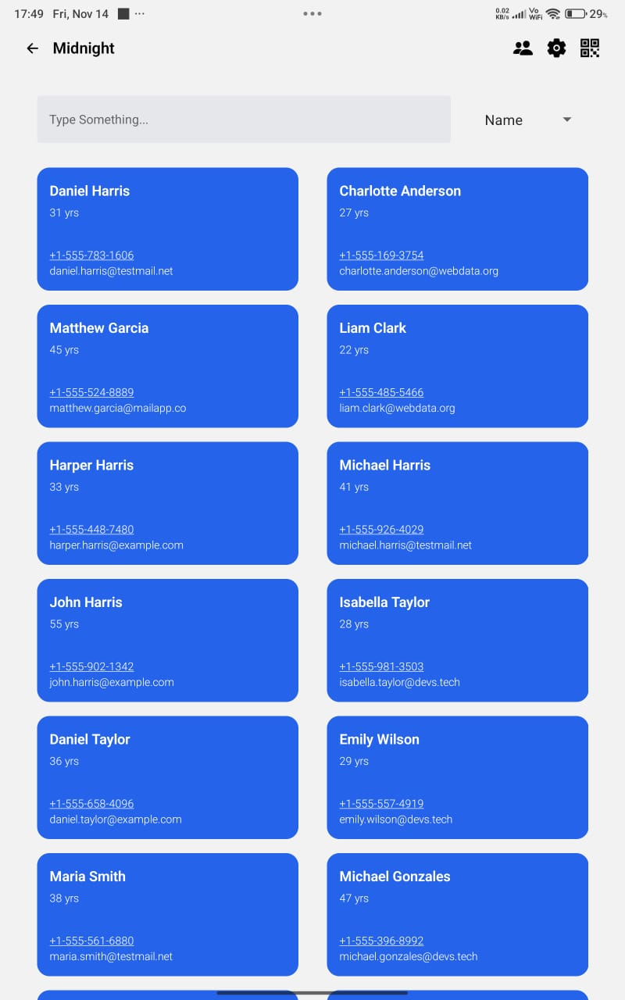

# Eventium

A full stack event management software you always need specially for Hack Club events.

**NOT AN OFFICIAL HACK CLUB APP. THIS APP IS DEVELOPED FROM MY EXPERIENCES OF ORGANISING DAYDREAM DELHI**

So yeah it's like Cockpit but better

## Features
 - Smart check-in - Fewer errors
 - Scan Participants QR Code to Provide Items - Check if the participant is not trying to get extra items without permission like extension boards or t-shirt or food.
 - Add organisers and collab like never before
 - Highlight under-age or over-age participants 
 - Keep track of waivers
 - More

All users are provided with an event for test. All the participant data in the app is synthetic.

Again, please note that RLS is disbaled for now in Supabase, please do not put your sensitive info.
