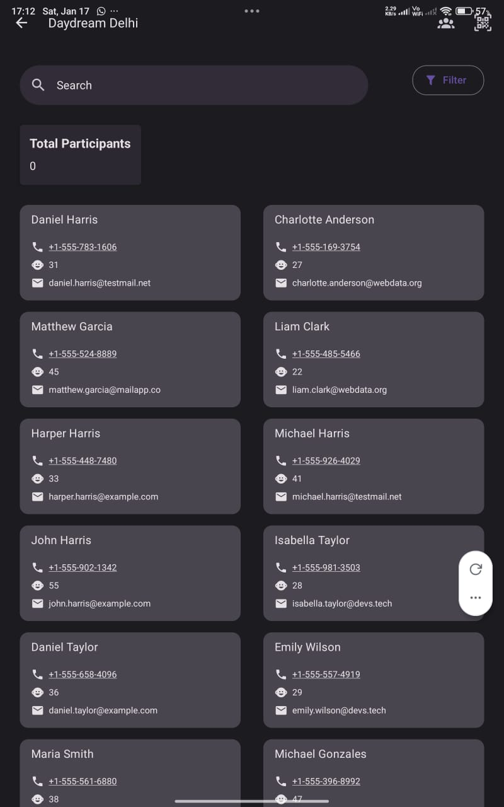
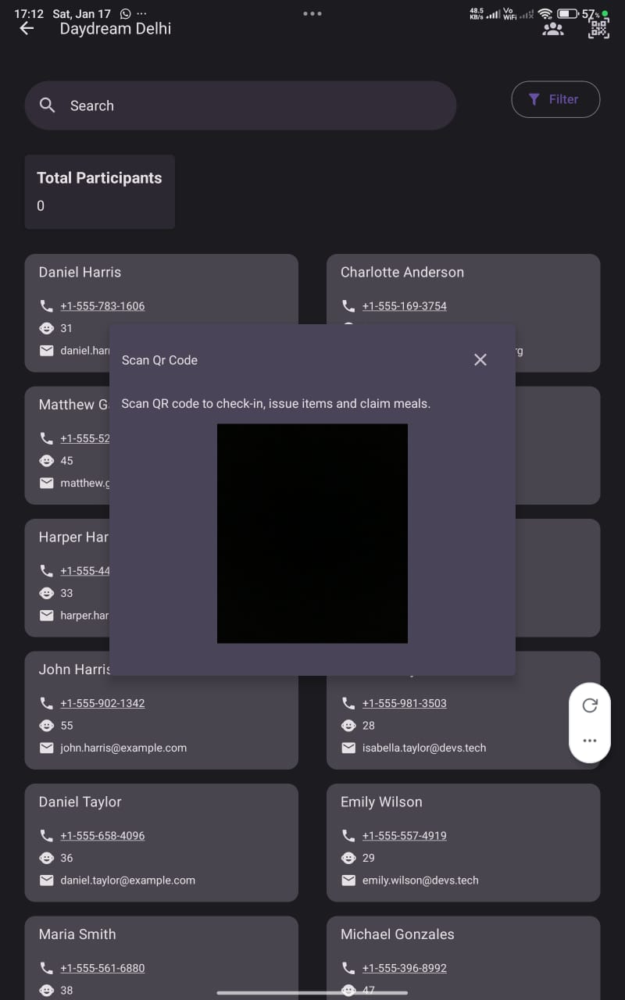
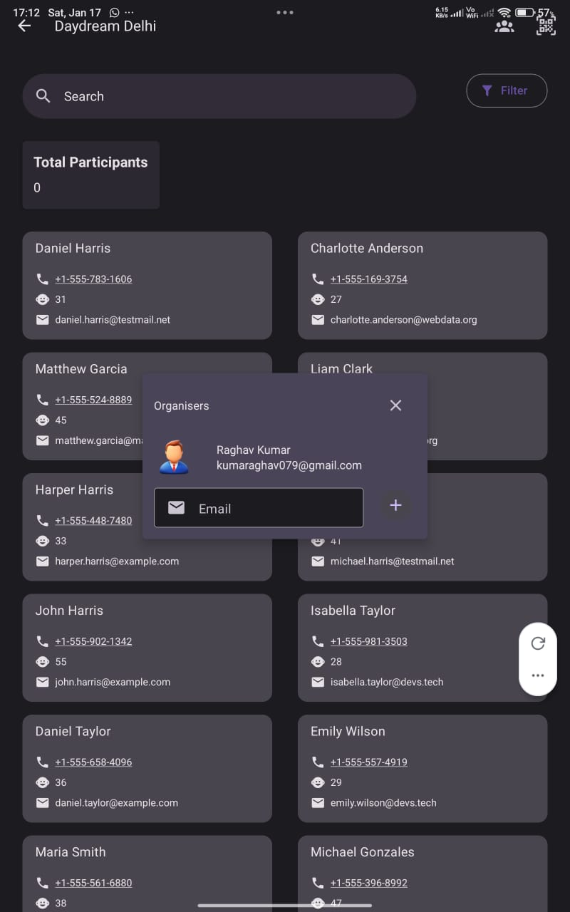

# Eventium  
## A full-suite event management platform, built from real event experience

**Eventium** is an event management software that helps your team manage **on-ground event operations** seamlessly—so you can focus on what matters most: **the experience**.

This project was built from firsthand experience organizing events at **Daydream Delhi**, serving as a practical Proof of Concept (PoC) for real-world event workflows.

---

## Screenshots






---

## Features

- Highly collaborative event operations  
- QR code scanning for **participant check-in** and **item issuance**  
- Centralized participant data management  
- Designed for real-time, on-site usage  

---

## Installation

### 1️⃣ Server Setup (Development / Self-Hosted)

Eventium currently requires users to **self-host the API server**.

#### Prerequisites
- Docker  
- Docker Compose  

#### Steps

1. Go to **Releases** and download the latest **server package**
2. Extract the files
3. Start the server using Docker:
   ```bash
   docker compose up
   ```
4. The server will start locally on:
   ```
   http://localhost:8000
   ```

#### Expose Server to the Internet (Required for App)

Use **ngrok** (or a similar tunneling service):

```bash
ngrok http 8000
```

Copy the generated HTTPS URL:
```
https://xxxx.ngrok-free.app
```

This URL will be required inside the mobile application.

---

### 2️⃣ Application Installation

- Go to **Releases**
- Download the latest **Eventium APK**
- Install it on your Android device
- On first launch, you will see **“Notice For Developers”**
- Paste the **server URL** (ngrok link) into the input box

Once logged in:
- A test event (**Daydream Delhi**) is automatically added to your account

---

## Notes

- This setup is intended for **development and testing**
- Production deployment will require:
  - Secure API hosting
  - Proper secrets management
  - Environment hardening

---

Built with real-world event experience.  
Designed for reliability on the ground.
